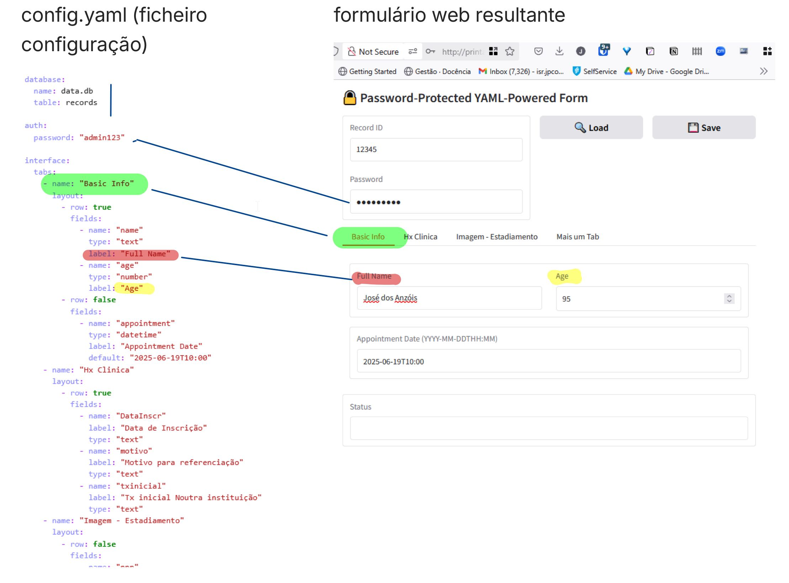

# Formulário web configurável para SQLite

Base de dados com formulario gradio

## Componentes principais:

- Formulário de consulta e actualização através de web browser
- Dados guardados em base de dados SQLight
- Base de Dados e formulário totalmente especificado a partir de ficheiro de configuração config.yaml 

### Para detalhes consultar pasta app
[app/config.yaml](app/config.yaml)
### Utilitários importantes

- Editor de SQL: https://dbeaver.com/docs/dbeaver/ https://sqlitebrowser.org/dl/
- Gradio https://www.gradio.app/
- 
